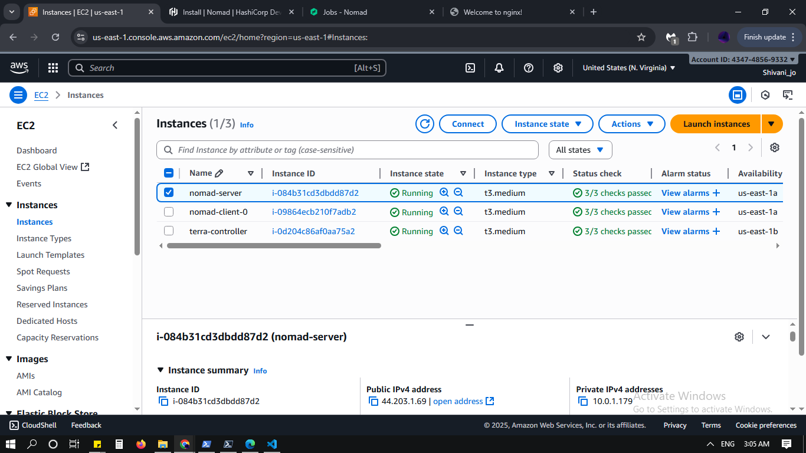
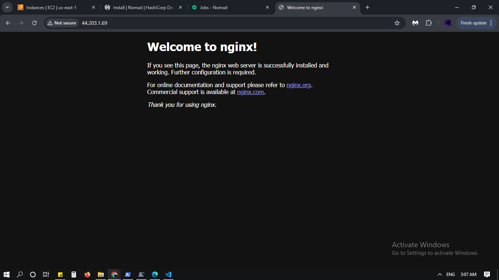

# Nomad Terraform Cluster

## Overview

This repository provisions a secure, scalable, and resilient HashiCorp Nomad cluster on AWS using Terraform. It includes:
- Infrastructure as Code (IaC) using Terraform.
- AWS IAM integration for secure access and automation.
- GitHub Actions for CI/CD.
- Logging and metrics setup for observability.

## Architecture

- **VPC:** Custom VPC with public and private subnets.
- **Nomad Server:** Runs in the public subnet.
- **Nomad Clients:** Run in the private subnet; easily scalable.
- **Security Groups:** Restrict access to Nomad UI, application, and SSH by CIDR.
- **IAM:** Used for authenticated AWS CLI and automation.
- **GitHub Actions:** Automates Terraform deployment.
- **Observability:** Logging via Nomad and Docker; Metrics exposed for monitoring.

**Nomad Cluster Architecture:**



## Directory Structure

```
.
├── jobs/hello-world.nomad         # Sample Nomad job (nginx container)
├── main.tf                        # Main Terraform config
├── modules/                       # Terraform modules (vpc, nomad-server, nomad-client)
├── outputs.tf                     # Terraform outputs
├── scripts/                       # Bootstrap and install scripts
├── variables.tf                   # Terraform variables
├── .github/workflows/terraform.yml# GitHub Actions workflow (CI/CD)
├── images/                        # Screenshots and diagrams
```

## Prerequisites

- AWS account & access keys (IAM user recommended)
- EC2 Key Pair (for SSH)
- Terraform >= 1.3.0
- AWS CLI (configured with IAM user)
- GitHub repository secrets set for CI/CD

## Getting Started

### 1. Clone the Repository

```sh
git clone https://github.com/assign-stone/nomad-terraform-cluster.git
cd nomad-terraform-cluster
```

### 2. Configure AWS CLI (IAM User)

```sh
aws configure
```
Enter your IAM user's access key and secret key. This is required for both local Terraform and GitHub Actions automation.

### 3. Set Required Variables

Edit `variables.tf` as needed:
- `key_name` – Your EC2 Key Pair name
- `allowed_cidr` – Your IP/CIDR for UI/SSH access

### 4. Initialize & Apply Terraform

```sh
terraform init
terraform plan
terraform apply
```

### 5. Access Nomad UI

- Get the public IP:
  ```sh
  terraform output nomad_server_public_ip
  ```
- Open in browser:
  ```
  http://<public-ip>:4646/ui/
  ```
  (Accessible only from your allowed CIDR.)

**Nomad UI Example:**


### 6. Deploy Hello-World Job

SSH to the Nomad server:

```sh
ssh -i <your-key.pem> ec2-user@<public-ip>
nomad job run jobs/hello-world.nomad
```

When the job is running, visit:
```
http://<public-ip>:8080/
```

**Nginx Page Screenshot:**



## CI/CD with GitHub Actions

This repo includes a workflow for CI/CD:

- `.github/workflows/terraform.yml` automates Terraform actions on push/PR.
- **Setup:**  
  Add your AWS credentials (IAM user) as GitHub secrets:
  - `AWS_ACCESS_KEY_ID`
  - `AWS_SECRET_ACCESS_KEY`

## Logging & Metrics

### Nomad & Docker Logs

- View Nomad logs:
  ```sh
  sudo journalctl -u nomad -f
  ```
- View allocation logs (job logs):
  ```sh
  nomad alloc logs <allocation-id>
  ```
  Find allocation ID with:
  ```sh
  nomad job status hello-world
  ```

### Metrics

Nomad exposes Prometheus metrics when enabled in the config:
```hcl
telemetry {
  collection_interval = "1m"
  prometheus_metrics  = true
}
```
Check metrics endpoint:
```
http://<public-ip>:4646/v1/metrics
```

## IAM Usage

- Used to authenticate AWS CLI and Terraform actions.
- Secures automation via GitHub Actions (no hardcoded credentials).
- Sample command to verify IAM identity:
  ```sh
  aws sts get-caller-identity
  ```

## Security Best Practices

- Use IAM users with limited permissions for automation.
- Restrict Nomad UI and SSH access via Security Groups (`allowed_cidr`).
- Rotate IAM credentials regularly.
- For extra protection, use SSH tunneling for UI, avoid public exposure.

## Troubleshooting

- **Job fails to start:** Check job logs (`nomad alloc logs ...`) and Docker status (`sudo systemctl status docker`).
- **Port conflicts:** Make sure exposed ports (e.g., 8080) are not in use.
- **No logs in UI:** Use CLI to fetch logs.
- **Metrics not visible:** Ensure telemetry block is in Nomad config and Nomad is restarted.

## Useful Commands

- **Initialize Terraform:** `terraform init`
- **Plan Terraform:** `terraform plan`
- **Apply Terraform:** `terraform apply`
- **Nomad job status:** `nomad job status hello-world`
- **Nomad job logs:** `nomad alloc logs <allocation-id>`
- **Nomad server logs:** `sudo journalctl -u nomad -f`
- **Docker status:** `sudo systemctl status docker`
- **AWS IAM identity:** `aws sts get-caller-identity`

## License

MIT

## Author

assign-stone
