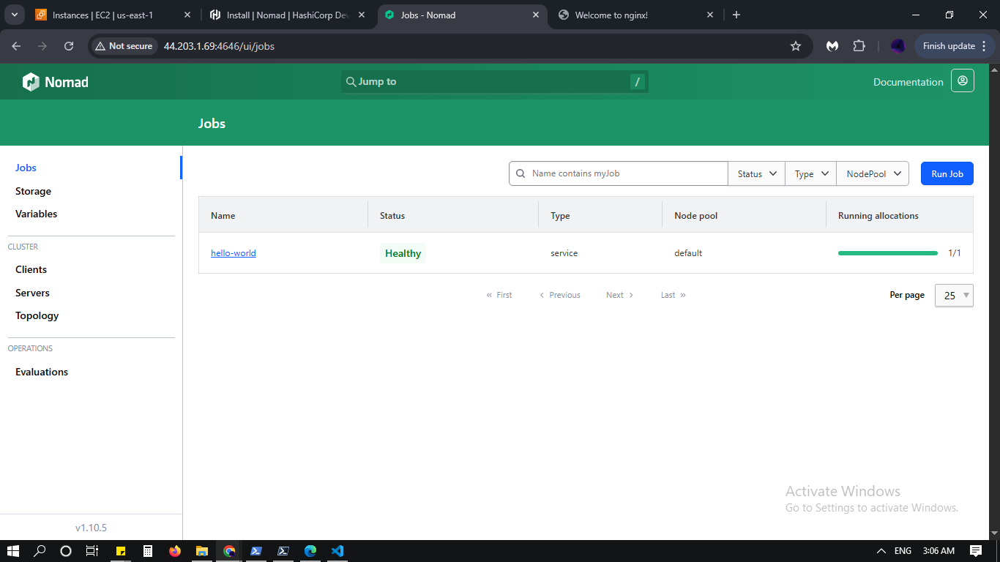
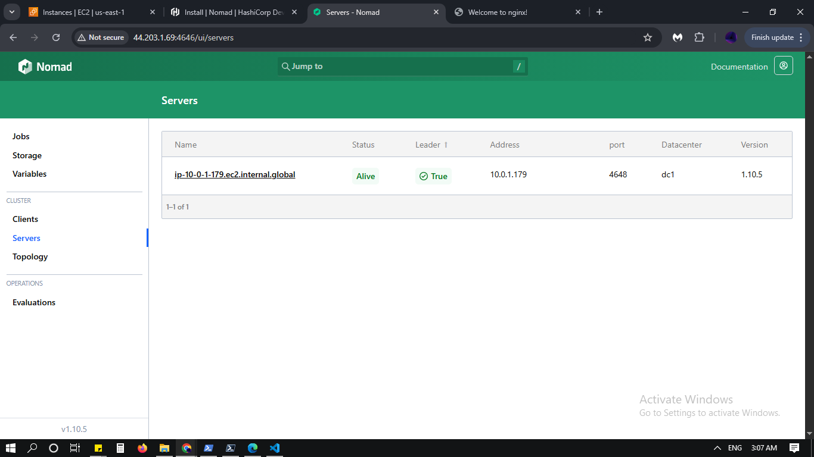
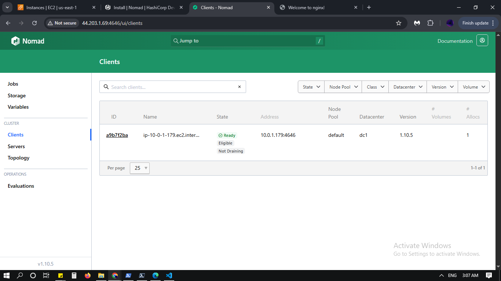

# HashiCorp Nomad Cluster on AWS: Automated IaC with Terraform and GitHub Actions

## Overview

This repository provisions a secure, scalable, and resilient HashiCorp Nomad cluster on AWS using Terraform. It includes:
- Infrastructure as Code (IaC) using Terraform.
- AWS IAM integration for secure access and automation.
- GitHub Actions for CI/CD.
- Logging and metrics setup for observability.

## Architecture

- **VPC:** Custom VPC with public and private subnets.
- **Nomad Server:** Runs in the public subnet.
- **Nomad Clients:** Run in the private subnet; easily scalable.
- **Security Groups:** Restrict access to Nomad UI, application, and SSH by CIDR.
- **IAM:** Used for authenticated AWS CLI and automation.
- **GitHub Actions:** Automates Terraform deployment.
- **Observability:** Logging via Nomad and Docker; Metrics exposed for monitoring.

**Nomad Cluster Architecture:**


## Directory Structure

```
.
├── jobs/hello-world.nomad         # Sample Nomad job (nginx container)
├── main.tf                        # Main Terraform config
├── modules/                       # Terraform modules (vpc, nomad-server, nomad-client)
├── outputs.tf                     # Terraform outputs
├── scripts/                       # Bootstrap and install scripts
├── variables.tf                   # Terraform variables
├── .github/workflows/terraform.yml# GitHub Actions workflow (CI/CD)
├── images/                        # Screenshots and diagrams
```

## Prerequisites

- AWS account & access keys (IAM user recommended)
- EC2 Key Pair (for SSH)
- Terraform >= 1.3.0
- AWS CLI (configured with IAM user)
- GitHub repository secrets set for CI/CD

## Getting Started

### 1. Clone the Repository

```sh
git clone https://github.com/assign-stone/nomad-terraform-cluster.git
cd nomad-terraform-cluster
```

### 2. Configure AWS CLI (IAM User)

```sh
aws configure
```
Enter your IAM user's access key and secret key. This is required for both local Terraform and GitHub Actions automation.

### 3. Set Required Variables

Edit `variables.tf` as needed:
- `key_name` – Your EC2 Key Pair name
- `allowed_cidr` – Your IP/CIDR for UI/SSH access
- `region` – AWS region to deploy; default is `us-east-1`

### 4. Initialize & Apply Terraform

```sh
terraform init
terraform plan
terraform apply
```

### 5. Access Nomad UI

- Get the public IP:
  ```sh
  terraform output nomad_server_public_ip
  ```
- Open in browser:
  ```
  http://<public-ip>:4646/ui/
  ```
  (Accessible only from your allowed CIDR.)

**Nomad UI Example:**





### 6. Deploy Hello-World Job

SSH to the Nomad server:

```sh
ssh -i <your-key.pem> ec2-user@<public-ip>
nomad job run jobs/hello-world.nomad
```

When the job is running, visit:
```
http://<public-ip>:8080/
```

**Nginx Page Screenshot:**


## CI/CD with GitHub Actions

This repo includes a workflow for CI/CD:

- `.github/workflows/terraform.yml` automates Terraform actions on push/PR.
- **Setup:**  
  Add your AWS credentials (IAM user) as GitHub secrets:
  - `AWS_ACCESS_KEY_ID`
  - `AWS_SECRET_ACCESS_KEY`

## Credentials Required for Testing

To deploy and access the infrastructure, you will need:

- **AWS Credentials:**  
  An IAM user’s Access Key ID and Secret Access Key with permissions for EC2, VPC, IAM, and related services.  
  *How to get:* Create an IAM user in AWS, attach the necessary policies (e.g., AdministratorAccess for demo/testing), and generate/access keys.

- **EC2 Key Pair:**  
  Required to SSH into the Nomad server.  
  *How to get:*  
    - Go to AWS Console > EC2 > Key Pairs > Create Key Pair.  
    - Download the `.pem` file and specify its name in `variables.tf` (`key_name`).

- **AWS Region:**  
  This infrastructure is deployed in `us-east-1`.  
  *Make sure your AWS CLI and Terraform are configured to use `us-east-1`, or update the region in your Terraform files if needed.*

- **CIDR for Allowed Access:**  
  The `allowed_cidr` variable in `variables.tf` controls which IP addresses can access Nomad UI and SSH.  
  *Set this to your own public IP address for security, or use `0.0.0.0/0` to allow access from anywhere for testing (not recommended for production).*  
  *How to set:*  
    - Find your public IP using a service like [https://ifconfig.me](https://ifconfig.me)  
    - Set `allowed_cidr = "YOUR.IP.ADDRESS/32"` (e.g., `"203.0.113.5/32"`)  
    - Or, for open access (testing only): `allowed_cidr = "0.0.0.0/0"`

- **GitHub Secrets for CI/CD:**  
  - `AWS_ACCESS_KEY_ID`
  - `AWS_SECRET_ACCESS_KEY`  
  *How to set:* Add these secrets in your GitHub repository settings under "Secrets and variables".

- **GitHub Actions Environment Permissions:**  
  In your GitHub repository settings, you can configure environments (such as "production") and set specific permissions for who can approve or trigger deployments.  
  For this project, a "production" environment was created and permissions were set so that only your account can approve and apply Terraform changes via GitHub Actions.  
  *How to check:*  
    - Go to your repository > Settings > Environments > production  
    - Review environment protection rules and required reviewers.

> **Note:** For security, do not commit credentials to the repository. Always use environment variables, secret managers, GitHub secrets, and repository environment protection.

**Example of `variables.tf` configuration:**
```hcl
variable "region" {
  default = "us-east-1"
}
variable "key_name" {
  default = "your-keypair-name"
}
variable "allowed_cidr" {
  default = "203.0.113.5/32" # replace with your IP, or use "0.0.0.0/0" for open testing
}
```

## Logging & Metrics

### Nomad & Docker Logs

- View Nomad logs:
  ```sh
  sudo journalctl -u nomad -f
  ```
- View allocation logs (job logs):
  ```sh
  nomad alloc logs <allocation-id>
  ```
  Find allocation ID with:
  ```sh
  nomad job status hello-world
  ```

### Metrics

Nomad exposes Prometheus metrics when enabled in the config:
```hcl
telemetry {
  collection_interval = "1m"
  prometheus_metrics  = true
}
```
Check metrics endpoint:
```
http://<public-ip>:4646/v1/metrics
```

## IAM Usage

- Used to authenticate AWS CLI and Terraform actions.
- Secures automation via GitHub Actions (no hardcoded credentials).
- Sample command to verify IAM identity:
  ```sh
  aws sts get-caller-identity
  ```

## Security Best Practices

- Use IAM users with limited permissions for automation.
- Restrict Nomad UI and SSH access via Security Groups (`allowed_cidr`).
- Rotate IAM credentials regularly.
- For extra protection, use SSH tunneling for UI, avoid public exposure.

## Troubleshooting

- **Job fails to start:** Check job logs (`nomad alloc logs ...`) and Docker status (`sudo systemctl status docker`).
- **Port conflicts:** Make sure exposed ports (e.g., 8080) are not in use.
- **Logs in UI:** Use CLI to fetch logs.
- **Metrics not visible:** Ensure telemetry block is in Nomad config and Nomad is restarted.

## Useful Commands

- **Initialize Terraform:** `terraform init`
- **Plan Terraform:** `terraform plan`
- **Apply Terraform:** `terraform apply`
- **Destroy Terraform Infra:** `terraform destroy`
- **Nomad job status:** `nomad job status hello-world`
- **Nomad job logs:** `nomad alloc logs <allocation-id>`
- **Nomad server logs:** `sudo journalctl -u nomad -f`
- **Docker status:** `sudo systemctl status docker`
- **AWS IAM identity:** `aws sts get-caller-identity`

## Future Improvements / Bonus Task Considered

As part of this project, I explored additional enhancements to further improve the infrastructure and deployment process. While these features are not currently implemented, they represent possible next steps for future development:

- **Automated Monitoring Stack (Prometheus & Grafana):**  
  I attempted to set up automated monitoring for the Nomad cluster. Although the metrics endpoint is exposed and ready for scraping, the full integration with Prometheus and Grafana was not completed in this version. This is a recommended next step for production observability.

- **Automated Secrets Management:**  
  The AWS credentials required for CI/CD were securely configured using GitHub Secrets in the repository settings. For further enhancement, integration with AWS Secrets Manager or HashiCorp Vault could be considered.

These enhancements are planned for future iterations but have been considered with best practices and future improvements in mind.

## License

MIT

## Author

assign-stone
